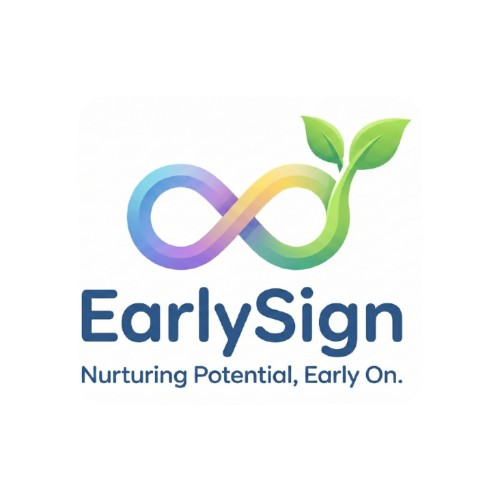
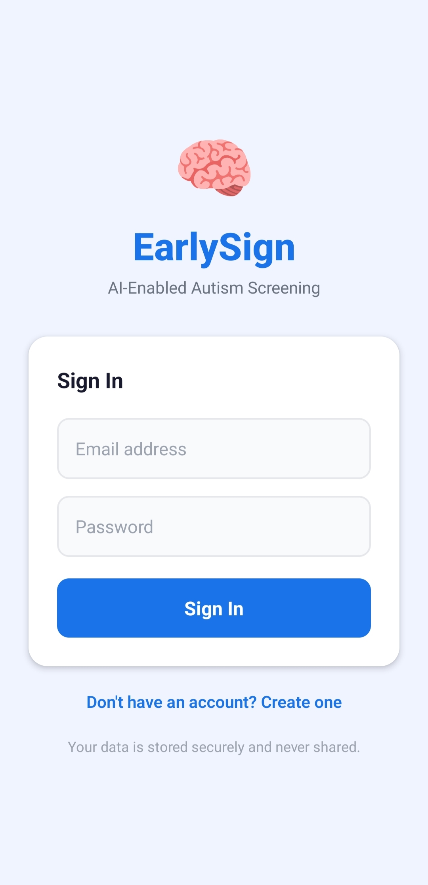
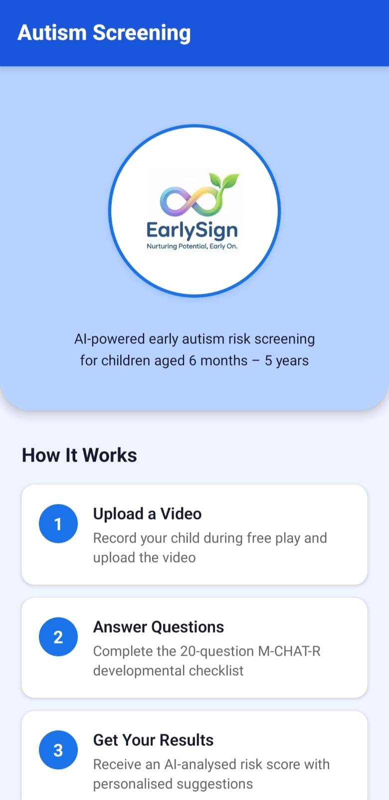
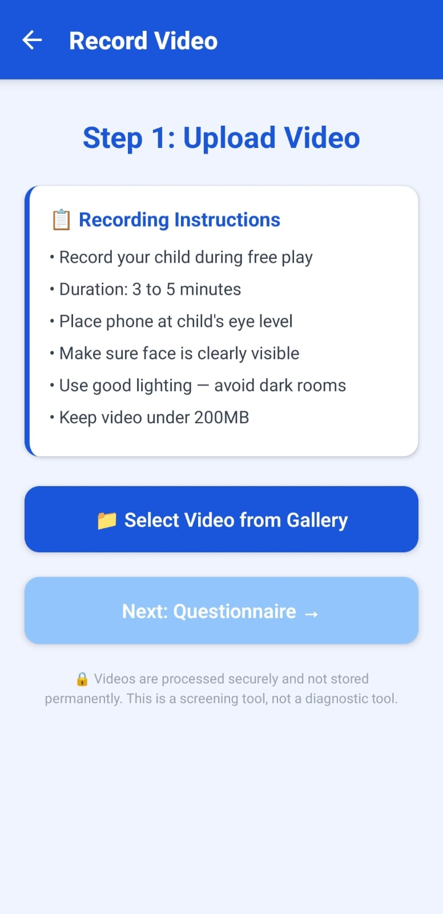
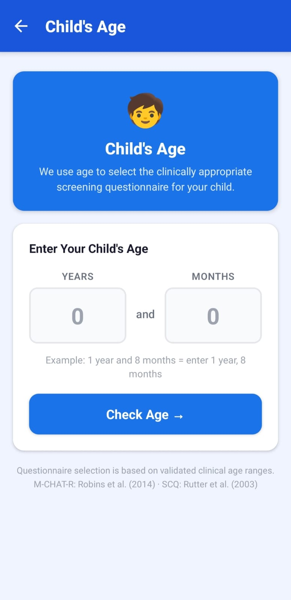
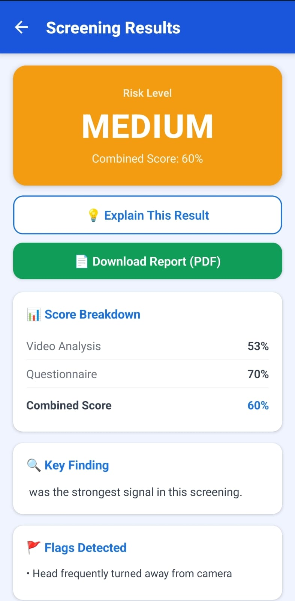
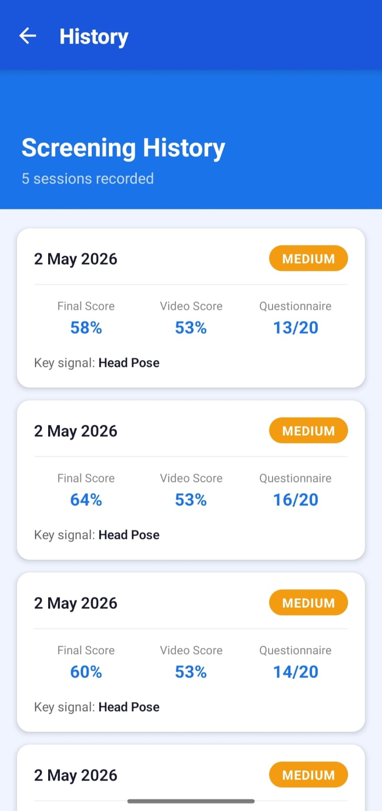
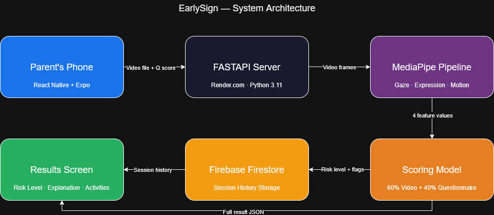

<div align="center">
  

  # EarlySign
  ### AI-Enabled Early Autism Screening Platform
  ### *Nurturing Potential, Early On.*

  
  
  
  
  
  
  [](https://github.com/ShuklaDevansh/EarlySign-Autism-Screening-app/releases/latest)
</div>

---

> ⚠️ **IMPORTANT DISCLAIMER**
>
> EarlySign is a **screening tool only**. It does **not** diagnose Autism Spectrum Disorder or any other medical condition. All results are indicative only and must be reviewed by a qualified paediatric healthcare professional. This is an academic prototype that has not undergone clinical trials and is not cleared for medical use by any regulatory body.

---

## Project Overview

EarlySign is a mobile-first, AI-assisted autism risk screening platform for children. It combines two inputs — a short video of the child during free play and a clinically appropriate questionnaire — and uses computer vision to extract five objective behavioural signals from the video.

The app automatically selects the right questionnaire based on the child's age: M-CHAT-R (validated for 16–30 months) or the Social Communication Questionnaire — SCQ (validated for 4 years and above). The video signals and questionnaire score are fused using a weighted formula to produce a risk level of LOW, MEDIUM, or HIGH, with a plain-English explanation, primary contributing feature, triggered flags, dynamic activity suggestions, and a downloadable PDF report.

EarlySign is designed to give parents an accessible, objective first step before seeking specialist evaluation — addressing the global gap where the majority of children who could benefit from early autism screening never receive it due to the shortage of diagnostic specialists.

---

## Screenshots

<div align="center">
   &nbsp;
   &nbsp;
   &nbsp;
  
  <br/><br/>
   &nbsp;
  
</div>

---

## Download

**Android APK — direct install:**

1. Go to [Releases](https://github.com/ShuklaDevansh/EarlySign-Autism-Screening-app/releases/latest) and download `EarlySign.apk`
2. On your Android phone, open the downloaded file
3. If prompted, enable **Install from unknown sources** in your phone settings
4. Tap Install

> iOS is not available as a direct install — use Expo Go with the development build for iOS testing.

---

## System Architecture



The platform follows a six-component pipeline:

- **Parent's Phone** — React Native app handles auth, video capture, age routing, questionnaire, and results display
- **FastAPI Server** — receives video and score, orchestrates the full processing pipeline
- **MediaPipe Pipeline** — extracts 5 behavioural features from quality-filtered sampled video frames
- **Scoring Model** — combines video features and questionnaire score into a final weighted risk score
- **Firebase** — Authentication for secure per-user accounts, Firestore for longitudinal session history
- **Results Screen** — displays risk level, explanation, feature contributions, flags, suggestions, and PDF export

---

## Tech Stack

### Backend

| Technology | Version | Purpose |
|---|---|---|
| Python | 3.11.9 | Core backend language |
| FastAPI | 0.129.2 | REST API framework |
| Uvicorn | 0.41.0 | ASGI server |
| MediaPipe | 0.10.9 | Face mesh, pose, and holistic landmark extraction |
| OpenCV | 4.13.0 | Video frame extraction and quality filtering |
| NumPy | 2.4.2 | Feature computation and normalisation |
| scikit-learn | 1.8.0 | Scoring model utilities |
| python-multipart | 0.0.22 | Multipart video file upload handling |

### Frontend

| Technology | Version | Purpose |
|---|---|---|
| React Native | Expo SDK 51 | Cross-platform mobile app (Android + iOS) |
| Expo Document Picker | 14.0.8 | Video selection from device gallery |
| expo-print | Latest | PDF generation from HTML |
| expo-sharing | Latest | Native share sheet for PDF export |
| Axios | 1.13.6 | HTTP requests to FastAPI backend |
| React Navigation | Stack | Screen-to-screen navigation |
| Firebase Auth | Latest | Email/password authentication |
| Firebase Firestore | Latest | Per-user session history storage |

---

## How It Works

**Step 1 — Sign In**
Parents create a secure account with email and password via Firebase Authentication. Session history is tied to their account and accessible across devices.

**Step 2 — Upload Video**
The parent selects a short video of their child during free play (3–5 minutes recommended, max 200MB). The app validates file size before upload.

**Step 3 — Child's Age**
The parent enters the child's age in years and months. The app automatically selects the clinically appropriate questionnaire and explains why — M-CHAT-R for 16–30 months, SCQ for 4 years and above, with honest caution messaging for the 31–47 month clinical gap and a direct referral recommendation for under 16 months.

**Step 4 — Questionnaire**
The parent answers the appropriate questionnaire (M-CHAT-R: 20 questions, SCQ: 40 questions) via yes/no toggles with a live progress tracker. The app automatically calculates the risk score on submission.

**Step 5 — Analysis**
The video is uploaded to the FastAPI backend. OpenCV extracts one frame every 30th frame. Each frame passes a quality filter (blur and brightness check) before MediaPipe runs face mesh, holistic pose, and landmark detection. Five behavioural features are extracted and normalised.

**Step 6 — Results**
The app displays the risk level (colour-coded LOW / MEDIUM / HIGH), score breakdown, the primary contributing signal, triggered flags, a plain-English explanation, and dynamic activity suggestions tied to the specific flags. The parent can download a formatted PDF report and share it. The session is saved to Firestore under their account.

---

## API Documentation

Interactive API documentation is auto-generated by FastAPI and available at `http://127.0.0.1:8000/docs` when running locally.

| Endpoint | Method | Description |
|---|---|---|
| `/` | GET | Health check — confirms server is running |
| `/analyze-video` | POST | Accepts video file + questionnaire score, returns full risk assessment JSON including all 5 feature contributions, flags, suggestions, and processing metadata |
| `/explain` | GET | Accepts result values as query parameters, returns a plain-English paragraph summary of what the result means for the parent |

---

## Feature Extraction

The MediaPipe pipeline extracts 5 behavioural features from quality-filtered video frames. Each frame is checked for blur (Laplacian variance) and brightness before being passed to landmark detection. All features are normalised to a 0.0–1.0 risk scale before scoring.

| Feature | What It Measures | Risk Threshold |
|---|---|---|
| **Average Gaze Deviation** | How far the iris centre deviates from the eye centre across frames. High deviation indicates reduced forward gaze. | Normalised ceiling: 0.50 (Tariq et al. 2018) |
| **Social Gaze Percentage** | Percentage of frames where the child is looking forward at the camera. Low percentage indicates reduced social attention. | Risk flag below 60% (Jones & Klin 2013) |
| **Expression Variance** | Standard deviation of facial landmark distances across frames. Low variance indicates reduced facial affect. | Risk flag below 0.015 (ASD behavioural literature) |
| **Repetitive Motion Score** | Mean zero-crossing rate of wrist Y-position over time. High rate indicates stereotyped repetitive movements. | Risk flag above 0.50 (ASD motor literature) |
| **Head Pose** | Yaw and pitch deviation from forward-facing position across frames. High deviation indicates social gaze avoidance. | Risk flag when forward-facing percentage falls below threshold |

If wrist landmarks are not visible, repetitive motion is excluded from the feature average and a `wrist_not_visible` flag is set.

---

## Scoring Formula

Video features are weighted and averaged into a single video risk score, then combined with the questionnaire score:

```
Final Score = (0.60 × Video Risk Score) + (0.40 × Questionnaire Score Normalised)
```

**Feature weights within Video Risk Score:**

| Feature | Weight |
|---|---|
| Gaze Deviation | 0.20 |
| Social Gaze Percentage | 0.20 |
| Expression Variance | 0.15 |
| Repetitive Motion | 0.15 |
| Head Pose | 0.30 |

**Questionnaire normalisation:**
- M-CHAT-R: `raw score (0–20) / 20.0`
- SCQ: `raw score (0–40) / 40.0 × 20` — normalised to the same 0–20 equivalent scale before fusion

**Risk Level Classification:**

| Score Range | Risk Level |
|---|---|
| 0.00 – 0.35 | 🟢 LOW |
| 0.35 – 0.65 | 🟡 MEDIUM |
| 0.65 – 1.00 | 🔴 HIGH |

The 60/40 weighting reflects research literature establishing that objective behavioural measurements carry stronger predictive validity for ASD risk than caregiver self-report alone (Tariq et al., 2018).

---

## Age-Based Questionnaire Routing

EarlySign is the first open-source mobile autism screening tool to implement clinically grounded age-based questionnaire selection. Most existing tools apply a single questionnaire regardless of age — which is clinically incorrect.

| Age Range | Tool Used | Clinical Basis |
|---|---|---|
| Under 16 months | No questionnaire — referral message | No validated parent-report tool exists for this window |
| 16–30 months | M-CHAT-R (20 questions) | Robins et al. (2014) — sensitivity 0.91, specificity 0.95 |
| 31–47 months | M-CHAT-R with caution banner | Clinically underserved gap — results interpreted with extra care |
| 48 months and above | SCQ (40 questions) | Rutter et al. (2003) — validated for 4 years and above |

---

## How to Run Locally

### Backend

**Requirements:** Python 3.11.9, Git

```bash
git clone https://github.com/ShuklaDevansh/EarlySign-Autism-Screening-app.git
cd EarlySign-Autism-Screening-app/backend

python -m venv venv

# Windows
venv\Scripts\activate
# macOS / Linux
source venv/bin/activate

pip install -r requirements.txt
uvicorn main:app --reload
```

Server runs at `http://127.0.0.1:8000`

> ⚠️ **MediaPipe must stay at version 0.10.9.** Versions above 0.10.14 removed the `mp.solutions` API on Linux. Do not upgrade.

### Frontend

**Requirements:** Node.js, Expo Go app on your phone

```bash
cd EarlySign-Autism-Screening-app/frontend/AutismScreen
npm install
npx expo start --lan
```

Scan the QR code with Expo Go. Your phone and computer must be on the same WiFi network.

Update `config.js` with your local backend URL:
```javascript
export const API_BASE_URL = "http://YOUR_LOCAL_IP:8000";
```

---

## Ethical Considerations

- **Not a diagnostic tool.** EarlySign is explicitly a screening aid. All MEDIUM and HIGH results include a mandatory recommendation for professional clinical evaluation.
- **Informed consent.** Any real-world deployment requires explicit parental consent for video collection and AI processing of a minor's behavioural data.
- **Data privacy.** Videos of children are sensitive personal data subject to COPPA (US), GDPR (EU), and the Digital Personal Data Protection Act 2023 (India). Videos are not stored server-side — they are processed and immediately deleted. Session metadata in Firestore contains no personally identifiable information beyond what the parent provides.
- **Algorithmic fairness.** Model thresholds are derived primarily from Western research populations. Future work must validate performance across diverse ethnic and cultural populations.
- **Prototype status.** This academic prototype has not undergone clinical trials and is not cleared for medical use by any regulatory body (FDA, CE Mark, CDSCO, or equivalent).

---

## Future Work

- **Clinical Validation Study** — A prospective study comparing EarlySign outputs against gold-standard ADOS-2 assessments across a diverse cohort is the essential next step toward any real-world deployment.
- **Supervised Learning Model** — Replace the current rule-based scoring with a trained classifier (Logistic Regression, Random Forest, or lightweight neural network) using IRB-approved labelled clinical data.
- **Speech Feature Integration** — Add audio analysis of the video using librosa or Wav2Vec 2.0 to extract vocalisation frequency, response-to-name latency, and speech prosody as a sixth behavioural modality.
- **Federated Learning** — Enable model improvement across diverse populations without centralising sensitive video data by sharing only gradients rather than raw data.
- **Confidence Interval Reporting** — Replace the single-point risk score with a score range (e.g. 44% ± 8%) based on frame count and feature consistency, giving a more statistically honest picture of result reliability.
- **Child Profile Management** — Support multiple child profiles under a single parent account for families with more than one child.

---

## Contributing

Contributions, issues, and feature requests are welcome.

1. Fork the repository
2. Create a feature branch: `git checkout -b feature/your-feature-name`
3. Commit your changes: `git commit -m "feat: description"`
4. Push to your branch: `git push origin feature/your-feature-name`
5. Open a Pull Request

For questions or collaboration, reach out via GitHub: [@ShuklaDevansh](https://github.com/ShuklaDevansh)

---

## References

- Robins, D.L., et al. (2014). Validation of the M-CHAT-R/F. *Pediatrics*, 133(1), 37–45.
- Tariq, Q., et al. (2018). Mobile detection of autism through machine learning on home video. *PLOS Medicine*, 15(11).
- Jones, W., & Klin, A. (2013). Attention to eyes is present but in decline in 2–6-month-old infants later diagnosed with autism. *Nature*, 504, 427–431.
- Rutter, M., et al. (2003). *Social Communication Questionnaire*. Western Psychological Services.
- World Health Organization (2023). Autism spectrum disorders. WHO Fact Sheet.
- Lugaresi, C., et al. (2019). MediaPipe: A framework for building perception pipelines. *arXiv:1906.08172*.
- American Psychiatric Association (2013). *DSM-5*. American Psychiatric Publishing.

---

<div align="center">
  <sub>EarlySign — Final Year B.Tech Project · Not for clinical use</sub>
</div>